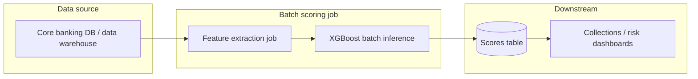
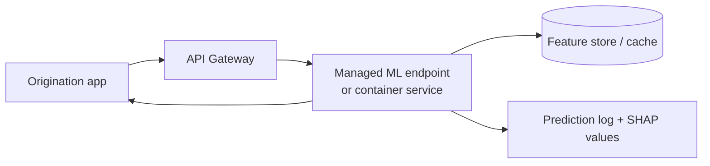
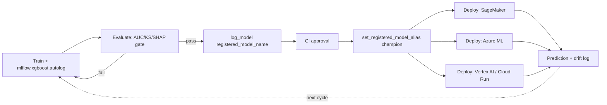

# Deploying ML Models on AWS vs GCP vs Azure — Serverless Functions, Container Serving & Managed ML Platforms

> **Problem.** Choose and architect a deployment path for machine learning models across AWS, GCP,
> and Azure, covering serverless functions (Lambda and equivalents), container-based serving, and
> managed ML platforms.
> **Worked example.** An XGBoost binary classifier predicting customer default (credit risk /
> collections) at a bank — tabular features, small model artifact (typically < 50 MB), prediction
> is a probability used for a decision (grant credit / flag for collections), regulatory scrutiny
> on explainability, and both batch (nightly scoring) and, in some flows, near-real-time (loan
> origination) latency requirements.
> **Assumptions.** Model trained with `xgboost` (Python), served via `predict_proba`; deployment
> region is a single cloud (no multi-cloud failover in scope); EU-style data-residency and
> explainability constraints are noted where they materially change the architecture.

---

## TL;DR

1. **For scheduled/batch credit scoring** (the dominant pattern in collections and underwriting
   pipelines): use the **managed ML platform's batch job** — SageMaker Batch Transform / Vertex AI
   Batch Prediction / Azure ML Batch Endpoints. No always-on infrastructure, native lineage and
   model-registry integration.
2. **For low-latency, low-traffic scoring** (e.g., a nightly job or an internal tool called
   sporadically): a **serverless function** (Lambda / Cloud Run functions / Azure Functions) with
   the XGBoost model bundled in the deployment package or a container image is the cheapest and
   simplest option — but mind the 15-minute (AWS) / 60-minute (GCP, Azure Premium) execution caps
   and cold-start latency.
3. **For sustained real-time traffic** (point-of-sale credit decisioning, API called continuously):
   use the **managed ML inference endpoint** (SageMaker real-time endpoint / Vertex AI Prediction /
   Azure ML Managed Online Endpoint) for built-in autoscaling, traffic splitting, and drift
   monitoring — or a **container-based serving** platform (App Runner / Cloud Run / Container Apps)
   if you want to own the serving code and avoid managed-platform pricing.
4. **Avoid Kubernetes (EKS/GKE/AKS) unless you already run it** — for a single tabular XGBoost
   model it adds operational burden (cluster ops, HPA, ingress, GPU scheduling) that this workload
   does not need; it only pays off at very high throughput or when you're consolidating many
   models on shared infra.
5. **Container registry and CI/CD wiring is nearly identical across clouds** (ECR/Artifact
   Registry/ACR + a build step); the real decision axis is *how much of the serving stack you want
   managed* (managed ML platform > container serving > Kubernetes, in terms of what's abstracted).
6. Whatever the path, treat **explainability (SHAP) and drift monitoring** as first-class
   requirements for a credit-default model — regulators (and internal model risk teams) expect
   both, and all three managed ML platforms provide native hooks for it.
7. **Put a model registry in front of every deployment target above.** Whether you use the
   cloud-native registry (SageMaker/Vertex AI/Azure ML) or a cross-cloud one (**MLflow Model
   Registry**), never deploy straight from a notebook — a registered, versioned, alias-gated model
   is what makes "which model scored this applicant" an auditable answer.

---

## Comparison table 1 — Serverless functions (AWS Lambda and equivalents)

| Axis | AWS Lambda | GCP Cloud Run functions (2nd gen)¹ | Azure Functions |
|---|---|---|---|
| Execution model | Event-driven, container-per-invocation | Event-driven, backed by Cloud Run under the hood | Event-driven, plan-dependent hosting |
| Max memory | 128 MB – 10,240 MB (10 GB); CPU scales with memory, up to 6 vCPU at max | Up to 32 GB (2nd gen), 1–2 CPU by default tier, configurable | 1.5 GB (Consumption plan); higher on Premium/Flex/Dedicated |
| Max timeout | 900 s (15 min) hard ceiling | 3,600 s (60 min) for HTTP functions; 1,800 s scheduled; 540 s other event-driven | 5 min default / 10 min max on Consumption; unbounded (with grace periods) on Premium/Dedicated |
| Registry / packaging | .zip or container image via ECR | Source-based or container image via Artifact Registry | .zip, container image, or source via ACR |
| GPU support | No (function layer) | Yes, L4 GPUs in preview via Cloud Run backing | No (function layer) |
| Cold start | Present; mitigated with Provisioned Concurrency | Present; mitigated with min-instances | Present; mitigated with Premium "always ready" instances |
| Best fit | Widest event-source integration (200+), mature ecosystem | Best if already on GCP data/AI stack (Pub/Sub, BigQuery, Vertex AI) | Best if already on Microsoft stack (AD, Logic Apps, OpenAI on Azure) |

¹ *Google rebranded "Cloud Functions" to "Cloud Run functions" as they now run on Cloud Run
infrastructure; 1st-gen limits are smaller (540 s max, no per-instance concurrency).*

**Applied to the XGBoost use case:** a serialized XGBoost model (Booster or sklearn wrapper) is
typically a few MB to a few tens of MB — well within all three platforms' package-size limits
(Lambda: 250 MB unzipped for .zip, up to 10 GB via container image). Inference for a single record
or small batch takes milliseconds to low seconds, so none of the timeout ceilings above are
binding for this workload; the deciding factors are usually **cost at your invocation volume**,
**cold-start tolerance**, and **which cloud already hosts your feature store / data warehouse**.

---

## Comparison table 2 — Container-based serving

| Requirement | AWS | GCP | Azure |
|---|---|---|---|
| General container serving | App Runner | Cloud Run | Container Apps |
| ML inference + monitoring | SageMaker Endpoints | Vertex AI Prediction | Azure ML Endpoints |
| GPU inference | SageMaker (GPU instances) | Cloud Run GPU / Vertex AI | Azure ML Endpoints (NC/ND series) |
| Scale to zero | ✅ | ✅ | ✅ |
| Container registry | ECR | Artifact Registry | ACR |
| Kubernetes under the hood | No | No | Yes (Container Apps → AKS) |
| VPC integration | VPC connector | Direct VPC egress | VNet integration |
| Traffic splitting / canary | SageMaker only (not App Runner) | ✅ native | ✅ native |
| Managed autoscaling | ✅ | ✅ | ✅ (KEDA-based) |

## Comparison table 3 — Deployment methods, end to end

| Method | Infra owner | Scaling | Cost model | Best for | Key trade-off |
|---|---|---|---|---|---|
| **Managed ML platform** (SageMaker / Vertex AI / Azure ML) | Cloud provider | Managed autoscaling, GPU-native | Per instance-hour | MLOps-integrated teams, regulated models | Convenience vs. vendor lock-in |
| **Container-based serving** (App Runner / Cloud Run / Container Apps) | Provider (compute), you (container) | Scale-to-zero, HTTP-based | Per request + CPU/mem | Custom serving logic | Flexibility vs. no built-in ML monitoring |
| **Serverless function** (Lambda / Cloud Run functions / Azure Functions) | Provider | Scale-to-zero, event-based | Per invocation + GB-s | Low/sporadic traffic, simple I/O | Cheapest at low volume, but timeout/memory ceilings |
| **Self-hosted Kubernetes** (EKS / GKE / AKS) | You | Manual / HPA / KEDA | Per node | High-throughput, many models on shared infra | Max control vs. max operational burden |
| **Batch job** (SageMaker Batch Transform / Vertex AI Batch Prediction / Azure ML Batch Endpoints) | Provider | Job-based, ephemeral compute | Per job compute-time | Nightly/periodic scoring (typical for credit risk) | No real-time capability |

---

## AWS Lambda *(serverless function)*

**What.** Event-driven FaaS; runs a container-per-invocation model with per-request billing.

**Pros.**
- Deepest event-source integration (S3, API Gateway, SQS/SNS, EventBridge, Step Functions).
- Container-image support up to 10 GB — enough to bundle XGBoost + a `predict.py` handler without
  a separate serving framework.
- Provisioned Concurrency removes cold starts for latency-sensitive paths at extra cost.

**Risks.**
- 15-minute hard timeout, not raisable even by AWS support — irrelevant for single-record XGBoost
  scoring, but relevant if you naively batch thousands of rows per invocation.
- No native GPU, no native drift monitoring — you own observability (CloudWatch + custom metrics).
- Function-level IAM and VPC configuration adds friction if the model needs to reach a private DB.

**How / verify.**
```bash
# Package a container-image Lambda for XGBoost scoring
aws lambda create-function \
  --function-name xgb-default-scorer \
  --package-type Image \
  --code ImageUri=123456789.dkr.ecr.eu-west-1.amazonaws.com/xgb-scorer:latest \
  --role arn:aws:iam::123456789:role/lambda-xgb-role \
  --memory-size 1024 \
  --timeout 30
```

---

## GCP Cloud Run functions *(Lambda equivalent)*

**What.** Google's FaaS offering; 2nd-gen functions run as Cloud Run services under the hood, with
Eventarc managing event triggers.

**Pros.**
- Up to 60-minute timeout for HTTP functions and up to 32 GB memory — more headroom than Lambda if
  you ever move to a heavier model or batch multiple predictions per call.
- Because it's Cloud Run underneath, migrating from "function" to "full container service" (Cloud
  Run) is a near-zero-friction path if the workload outgrows FaaS.
- Tight integration with BigQuery, Pub/Sub, and Vertex AI — convenient if your feature pipeline is
  already on GCP.

**Risks.**
- 1st-gen vs. 2nd-gen limit differences are a common source of confusion (1st gen caps at 540 s);
  make sure new deployments target 2nd gen explicitly.
- GPU access at the function layer is still preview-status — don't design a hard dependency on it.

**How / verify.**
```bash
# Deploy a 2nd-gen Cloud Run function for XGBoost scoring
gcloud functions deploy xgb-default-scorer \
  --gen2 \
  --runtime python312 \
  --region europe-west1 \
  --source . \
  --entry-point predict \
  --memory 1024MB \
  --timeout 30s \
  --trigger-http
```

---

## Azure Functions *(Lambda equivalent)*

**What.** Microsoft's FaaS offering; hosting plan (Consumption, Flex Consumption, Premium,
Dedicated) determines memory/timeout ceilings and cold-start behavior.

**Pros.**
- Durable Functions extension gives native multi-step orchestration (e.g., fetch features → score
  → write decision → notify) without a separate workflow engine.
- Deepest fit if the bank's identity, data platform, or OpenAI usage is already on Azure (AD,
  Synapse, Azure OpenAI) — consolidated billing and IAM.
- Premium/Dedicated plans remove the Consumption plan's tight 1.5 GB / 10-minute ceiling.

**Risks.**
- Consumption plan's default 5-minute timeout (max 10 min) and 1.5 GB memory are the tightest of
  the three clouds — fine for single-record XGBoost scoring, tight for anything heavier.
- HTTP-triggered functions behind the platform load balancer still hit a 230-second idle timeout
  regardless of `functionTimeout` — long-running HTTP calls need a polling/202-Accepted pattern.

**How / verify.**
```python
# function_app.py — Azure Functions Python v2 model, HTTP-triggered XGBoost scorer
import azure.functions as func
import xgboost as xgb
import numpy as np

app = func.FunctionApp()
booster = xgb.Booster()
booster.load_model("model.json")  # loaded once per warm instance

@app.route(route="score", methods=["POST"])
def score(req: func.HttpRequest) -> func.HttpResponse:
    features = np.array(req.get_json()["features"], dtype=np.float32).reshape(1, -1)
    prob_default = booster.predict(xgb.DMatrix(features))[0]
    return func.HttpResponse(f'{{"prob_default": {float(prob_default):.6f}}}',
                              mimetype="application/json")
```

---

## Managed ML platforms (SageMaker / Vertex AI / Azure ML)

**What.** Fully managed services covering training, model registry, and inference (real-time
endpoints, serverless inference, async inference, and batch transform/prediction).

**Pros.**
- Native model registry + versioning + blue/green or canary rollout — directly useful for a
  regulated credit model that needs an auditable trail of "which model version scored this
  applicant."
- Built-in **model monitoring / data drift detection** (SageMaker Model Monitor, Vertex AI Model
  Monitoring, Azure ML data drift monitors) — important for a default model, where the input
  distribution (macro conditions, customer mix) shifts over time.
- Batch Transform (AWS) / Batch Prediction (GCP) / Batch Endpoints (Azure) run ephemeral compute
  for large offline scoring jobs — the natural fit for nightly collections scoring.

**Risks.**
- More expensive at very low, sporadic traffic than a bare serverless function.
- Vendor-specific SDKs and deployment artifacts (SageMaker's `Model`/`EndpointConfig`, Vertex AI's
  `Model`/`Endpoint`, Azure ML's `Environment`/`ManagedOnlineDeployment`) increase migration cost
  between clouds.
- Real-time endpoints are always-on by default (billed per instance-hour) unless you explicitly use
  serverless/async inference variants.

**How / verify.**
```python
# AWS SageMaker — deploy the built-in XGBoost container as a real-time endpoint
import sagemaker
from sagemaker.xgboost import XGBoostModel

session = sagemaker.Session()
model = XGBoostModel(
    model_data="s3://bank-ml/models/default-xgb/model.tar.gz",
    role="arn:aws:iam::123456789:role/sagemaker-exec-role",
    framework_version="1.7-1",
)
predictor = model.deploy(initial_instance_count=1, instance_type="ml.m5.large")
```

---

## Self-hosted Kubernetes (EKS / GKE / AKS)

**What.** You own the cluster; the model is served via a `Deployment` + `Service`, typically behind
an Ingress, with autoscaling via HPA or KEDA.

**Pros.** Maximum control over networking, GPU scheduling, and multi-model co-location; makes
sense if you already run many models on a shared cluster.

**Risks.** For a single tabular XGBoost model this is disproportionate operational overhead —
cluster patching, ingress/TLS management, and incident response for pod crashes/OOM add cost
without a corresponding benefit at this scale.

**Critique.** This is the classic over-engineered choice for a single binary classifier. Reach for
it only if (a) you already operate the cluster for other workloads, or (b) throughput requirements
exceed what a managed container-serving/ML-endpoint tier comfortably handles.

---

## MLflow Model Registry — where it fits in this approach

**What.** MLflow's Model Registry is a **cloud-agnostic layer that sits between training and every
deployment target above**. A **registered model** is a named container for **model versions**; each
version carries lineage (which run produced it), tags, and **aliases** — mutable, named pointers
such as `champion`/`challenger` that resolve to a specific version. MLflow deprecated the older
four-stage lifecycle (`None → Staging → Production → Archived`) in favor of aliases + tags for
exactly this reason: aliases can be reassigned independently of code, and more than one alias can
point at a version (useful for canary/shadow testing a `challenger` alongside `champion`).

**Pros.**
- Decouples "which version is live" from your code: point a serving job at
  `models:/default-xgb@champion` instead of hardcoding a version number or a per-cloud endpoint ID.
- **One registry, three deployment paths.** The same registered XGBoost model can be exported to
  SageMaker (built-in `mlflow.sagemaker` module), to Azure ML (via the `azureml-mlflow` library and
  its managed online/batch endpoint integration), or containerized with `mlflow models build-docker`
  for GCP (Cloud Run / Vertex AI custom container — GCP has no built-in MLflow deployment plugin) or
  for App Runner/Container Apps.
- Native webhooks (`mlflow.webhooks`) fire on registry events — new version registered, alias
  reassigned — giving a CI/CD pipeline a real trigger instead of polling the registry.
- Complements, not replaces, the cloud-native registries in Comparison table 3. SageMaker Model
  Registry / Vertex AI Model Registry / Azure ML Model Registry track *deployment* state on their
  own platform; MLflow is the useful layer **if you might deploy the same model to more than one
  cloud, or want one serving-agnostic model catalog** for data-science teams that don't want to
  learn three vendor SDKs to answer "what's in production."

**Risks.**
- No first-class GCP deployment integration — Vertex AI needs a manual `build-docker` + push +
  deploy step, more wiring than the near-one-line AWS/Azure paths.
- Adds an operated component (tracking server + backend store + artifact store) — for a
  single-cloud, single-model setup, the cloud's own registry may be simpler and one less thing to
  secure/back up.
- Aliases are mutable pointers reassignable with a single API call — without an external approval
  gate (CI check, four-eyes review before reassigning `champion`) this is a production deployment
  action disguised as a metadata edit; wire it into your change-control process, not around it.

**How / verify.**
```python
import mlflow
from mlflow import MlflowClient

mlflow.set_tracking_uri("https://mlflow.mybank.internal")
mlflow.set_experiment("credit-default-xgb")

with mlflow.start_run() as run:
    mlflow.log_params(params)
    mlflow.log_metrics({"auc": auc, "ks": ks})
    mlflow.xgboost.log_model(
        booster, artifact_path="model",
        registered_model_name="default-xgb",  # creates/updates the registered model + new version
    )

client = MlflowClient()
# Promotion gate lives outside this snippet (CI job checking auc/ks/fairness thresholds)
client.set_registered_model_alias(name="default-xgb", alias="champion", version=run.info.run_id)
```

---

## Reference architectures — XGBoost credit-default classifier

Two patterns cover the vast majority of real bank deployments: **batch scoring** (the default for
collections/underwriting risk models, since decisions are usually made on a daily/nightly cycle)
and **real-time scoring** (needed at loan origination / point-of-sale). Each cloud maps cleanly
onto both.

### Pattern A — Nightly batch scoring (typical for collections risk)



- **AWS:** feature extraction as a Glue/EMR job or SQL against Redshift → model artifact from
  SageMaker Model Registry → **SageMaker Batch Transform** reads from S3, writes scores back to S3
  → loaded into Redshift/QuickSight.
- **GCP:** feature extraction as a BigQuery SQL/Dataflow job → model in Vertex AI Model Registry →
  **Vertex AI Batch Prediction** reads/writes BigQuery or GCS → scores queried directly from
  BigQuery for downstream dashboards.
- **Azure:** feature extraction via Azure Data Factory / Synapse pipeline → model in Azure ML
  Model Registry → **Azure ML Batch Endpoint** invoked as a pipeline step → scores written to
  Synapse/Blob Storage → Power BI.
- **Why batch fits collections modeling:** the label (default) resolves over weeks/months, so
  there is no operational need for sub-second scoring; batch keeps cost near zero between runs and
  gives a natural checkpoint for model-risk sign-off before scores are used.

### Pattern B — Real-time scoring (loan origination / point-of-sale)



- **AWS:** API Gateway → **SageMaker real-time endpoint** (autoscaling, data capture enabled) or,
  for lighter traffic, **Lambda (container image)** calling a locally-loaded Booster; predictions
  and SHAP values logged to S3 via SageMaker Model Monitor or a custom logger.
- **GCP:** API Gateway / Cloud Endpoints → **Vertex AI Prediction** endpoint with explanation
  config (Vertex Explainable AI, SHAP-based) enabled; or **Cloud Run** service for a lighter,
  self-managed FastAPI wrapper around the Booster.
- **Azure:** Azure API Management → **Azure ML Managed Online Endpoint** (traffic-split-ready for
  canary rollout of a new model version) or **Azure Functions** for low-traffic internal tools.
- **Governance layer (all three):** log every prediction with model version + SHAP feature
  attributions to satisfy explainability requirements common in credit decisioning (e.g., EBA
  guidelines on AI/ML in credit risk, GDPR Art. 22 on automated decision-making); keep this log in
  the same region as the data to satisfy EU data-residency constraints if applicable.

---

## Step-by-step: productionizing the XGBoost project in Python (with MLflow)

Steps 1–4 are standard ML-project setup; steps 5–9 are the productivization phase this report
focuses on — registry, promotion gate, and per-cloud deployment.

**1. Project structure.**
```
credit-default/
├── data/                # raw/, interim/, processed/ (never commit raw data)
├── src/
│   ├── features.py      # feature pipeline (fit on train only)
│   ├── train.py          # training + MLflow logging
│   └── serve.py          # thin prediction wrapper shared across all deploy targets
├── tests/
├── mlruns/               # local MLflow tracking (or point to a remote tracking server)
└── requirements.txt
```

**2. Time-based split (leakage-safe for credit risk).** Random splits leak future information into
training for time-dependent tabular data — split by application/observation date instead.
```python
import pandas as pd

df = pd.read_parquet("data/processed/applications.parquet")
train = df[df.application_date < "2025-07-01"]
val   = df[(df.application_date >= "2025-07-01") & (df.application_date < "2025-10-01")]
test  = df[df.application_date >= "2025-10-01"]
```

**3. Feature pipeline (fit on train only).**
```python
from sklearn.compose import ColumnTransformer
from sklearn.pipeline import Pipeline
from sklearn.preprocessing import OneHotEncoder
from xgboost import XGBClassifier

cat_cols = ["employment_type", "region"]
num_cols = ["age", "income", "existing_debt", "utilization_ratio"]

preprocess = ColumnTransformer([
    ("cat", OneHotEncoder(handle_unknown="ignore"), cat_cols),
], remainder="passthrough")

pipe = Pipeline([
    ("preprocess", preprocess),
    ("model", XGBClassifier(
        n_estimators=300, max_depth=4, learning_rate=0.05,
        eval_metric="auc", random_state=42,
    )),
])
pipe.fit(train[cat_cols + num_cols], train["defaulted"])
```

**4. Train with MLflow autologging.**
```python
import mlflow

mlflow.set_experiment("credit-default-xgb")
mlflow.xgboost.autolog()  # logs params, metrics, feature importance, and the model artifact

with mlflow.start_run(run_name="xgb-v1"):
    pipe.fit(train[cat_cols + num_cols], train["defaulted"])
    val_auc = roc_auc_score(val["defaulted"], pipe.predict_proba(val[cat_cols + num_cols])[:, 1])
    mlflow.log_metric("val_auc", val_auc)
```

**5. Evaluate against a promotion gate.** Before registering, check the metrics that matter for a
credit model, not just AUC — a CI job (not a person clicking "promote") should compute and enforce
these thresholds.
```python
from sklearn.metrics import roc_auc_score
import shap

y_prob = pipe.predict_proba(test[cat_cols + num_cols])[:, 1]
test_auc = roc_auc_score(test["defaulted"], y_prob)
ks_stat = ks_2samp(y_prob[test.defaulted == 1], y_prob[test.defaulted == 0]).statistic

explainer = shap.TreeExplainer(pipe.named_steps["model"])
shap_values = explainer.shap_values(preprocess.transform(test[cat_cols + num_cols]))

assert test_auc >= 0.75, "below minimum discrimination threshold"
assert ks_stat >= 0.30, "below minimum separation threshold"
# + fairness checks across protected/sensitive segments as required by internal model-risk policy
```

**6. Register the model version.**
```python
mlflow.xgboost.log_model(
    pipe.named_steps["model"], artifact_path="model",
    registered_model_name="default-xgb",
)
```
This creates version N of the `default-xgb` registered model — immutable, with full lineage back
to the run (params, metrics, code commit if logged via `mlflow.log_param("git_sha", ...)`).

**7. Promote via alias, gated by CI approval.** Reassigning `champion` is the actual "go live"
action — treat it like a deploy, with the same review/approval you'd require for any other
production change.
```python
from mlflow import MlflowClient

client = MlflowClient()
client.set_registered_model_alias(name="default-xgb", alias="champion", version=N)
```

**8. Deploy the registered model to the target cloud.** Load by alias, not by hardcoded version, so
re-running this step always ships the currently-approved model.
```python
# AWS — via the built-in mlflow.sagemaker integration
# $ mlflow deployments create -t sagemaker -m "models:/default-xgb@champion" \
#     --name xgb-default-prod --config region_name=eu-west-1

# Azure ML — via azureml-mlflow, registering straight from the MLflow model URI
# $ az ml model create --name default-xgb --version N --path "models:/default-xgb@champion" \
#     --type mlflow_model
# $ az ml online-endpoint create ... && az ml online-deployment create --model default-xgb:N ...

# GCP — no native plugin: build a serving image from the MLflow model, then deploy it
# $ mlflow models build-docker -m "models:/default-xgb@champion" -n xgb-default-server
# $ docker tag xgb-default-server europe-west1-docker.pkg.dev/PROJECT/repo/xgb-default-server
# $ docker push europe-west1-docker.pkg.dev/PROJECT/repo/xgb-default-server
# $ gcloud run deploy xgb-default-scorer --image ...xgb-default-server --region europe-west1
```

**9. Close the loop.** Log incoming feature distributions and predictions from the deployed
endpoint (via the cloud's model monitor or a custom logger), and feed that log back into step 2 of
the next training cycle — this is what makes drift detection (Monitoring in production, below)
actionable rather than a dashboard nobody acts on.



**CLI wrapper.** Expose steps 4/7/8 as `click` commands so the pipeline is scriptable from CI and
consistent across developers, instead of ad hoc notebook cells.
```python
# cli.py
import click

@click.group()
def cli(): ...

@cli.command()
@click.option("--train-until", default="2025-07-01")
def train(train_until):
    ...  # steps 2-4: split, fit pipeline, log_model with registered_model_name

@cli.command()
@click.option("--version", type=int, required=True)
def promote(version):
    ...  # step 7: set_registered_model_alias, gated by a separate CI approval step

@cli.command()
@click.option("--target", type=click.Choice(["sagemaker", "azureml", "cloudrun"]))
def deploy(target):
    ...  # step 8: dispatch to the matching per-cloud deploy path
```

**Optional: ONNX as a portable serving artifact.** Converting the Booster to ONNX
(`onnxmltools.convert_xgboost`) gives a single, language-agnostic runtime (`onnxruntime`) that can
serve the same file behind a lightweight container on any of the three clouds, without needing the
full XGBoost + Python stack in the serving image — useful if you're standardizing a serving layer
across several models/frameworks. It is a genuine option, not a default: worth it if the serving
container's dependency footprint or cross-language portability matters to you; **not worth it**
just to shrink an already-small tabular model. The trade-off to name explicitly: SHAP explanations
are computed against the native XGBoost Booster, not the ONNX graph — if you convert to ONNX for
serving, keep the registered MLflow model (native Booster) as the source for offline/batch SHAP
computation, and don't expect `onnxruntime` to give you per-decision attributions out of the box.
Conversion is also not always friction-free — watch for opset/shape mismatches on
multi-output or custom-objective models.
```python
import onnxmltools
from onnxmltools.convert.common.data_types import FloatTensorType

onnx_model = onnxmltools.convert_xgboost(
    booster, initial_types=[("input", FloatTensorType([None, n_features]))]
)
onnxmltools.utils.save_model(onnx_model, "model.onnx")
```

---

## Monitoring in production — per option, and where MLflow fits

**Where monitoring happens on each path:**

| Deployment option | Monitoring mechanism | Notes |
|---|---|---|
| SageMaker real-time endpoint | SageMaker Model Monitor (data capture + baseline + scheduled drift job) | Native, no extra infra |
| Vertex AI Prediction | Vertex AI Model Monitoring (skew/drift jobs against a baseline) | Native, configurable alerting |
| Azure ML Managed Online Endpoint | Azure ML data drift monitors | Native; pairs with Responsible AI dashboard for fairness |
| Batch Transform / Batch Prediction / Batch Endpoints | Compare each batch's score/feature distribution to a stored baseline as a pipeline step | Not automatic — you add the comparison step |
| Lambda / Cloud Run functions / Azure Functions / App Runner / Cloud Run / Container Apps | Nothing native for ML — log predictions + features yourself (CloudWatch/Cloud Logging/App Insights) and run a scheduled drift job against them | You own the whole loop |

**Does MLflow monitor models?** Not natively for classical ML, and worth being precise about this:
MLflow's current "Production Monitoring" / "AI Monitoring" capability is scoped to **GenAI/LLM/agent
traces** — quality, cost, and safety scoring of language outputs — not tabular feature or
prediction drift. For classical models, the MLflow project itself has an open feature request
(mlflow/mlflow#21603) proposing native drift/data-quality metrics precisely because, today, teams
"typically use Evidently to compute monitoring metrics and then manually log them into MLflow as
plain metrics or artifacts." So the honest answer is: **MLflow is a good metrics/artifact store and
dashboard for monitoring results, tied to the registered model version — it is not the detection
engine.** Use `mlflow.log_metric` / `mlflow.log_table` on a schedule to persist drift/performance
results next to the run that produced the deployed model; use a dedicated library to compute them.

**Recommended for this use case: NannyML (CBPE).** The credit-default label resolves months after
scoring (already flagged in Problem-specific considerations) — the standard cloud drift monitors
above compare *input feature* distributions, they don't estimate *model performance* without
labels. NannyML's Confidence-Based Performance Estimation does exactly that: it estimates AUC/KS
from the calibration of the predicted probabilities, so you get an early performance-degradation
signal weeks before the real default outcome is known. Treat it as complementary to, not a
replacement for, the cloud-native data-drift monitor — one checks the inputs, the other estimates
the output quality.

```python
import nannyml as nml
import mlflow

estimator = nml.CBPE(
    y_pred_proba="prob_default", y_pred="pred", y_true="defaulted",
    metrics=["roc_auc"], problem_type="classification_binary",
    chunk_period="W",
).fit(reference_data=val)  # reference = the validation set from step 2

results = estimator.estimate(production_scores)  # no labels needed here

with mlflow.start_run(run_name="weekly-perf-estimate"):
    mlflow.log_metric("estimated_auc", results.to_df()["estimated_roc_auc"].iloc[-1])
```

**Complementary: Evidently AI.** Better fit for classic *input* data drift and data-quality reports
(missing values, schema changes, feature distribution shift) across a reference vs. current window
— use it alongside NannyML rather than instead of it if you want both input-drift and label-free
performance-estimation coverage; log its report artifacts into MLflow the same way.

---

## Problem-specific considerations

- **Model size and load time.** A tabular XGBoost model is small (MBs); "cold start" is dominated
  by container/runtime boot, not model loading — favors serverless/container options over
  Kubernetes for this specific model family.
- **Feature parity between training and serving.** Whatever platform you choose, compute features
  with the *same code path* offline (training) and online (serving) — a mismatch here is the most
  common real-world source of degraded default-prediction accuracy, independent of cloud choice.
- **Explainability.** Regulated credit-risk use cases typically require per-decision explanations.
  Budget for SHAP computation at inference time (adds latency/cost) or precompute global
  explanations and only compute per-record SHAP for flagged/adverse decisions.
- **Class imbalance.** Default is typically a minority class; this affects model calibration, not
  the deployment architecture — but if you serve *calibrated probabilities* (e.g., via Platt
  scaling/isotonic regression wrapped around the Booster), make sure the calibration step is part
  of the same serialized artifact/pipeline that gets deployed, not a separate manual step.

## Diagnostics & pitfalls

- **Timeout/memory ceilings are not the binding constraint for this workload** — all three
  serverless platforms comfortably fit a single-record XGBoost scoring call; don't over-engineer
  around limits that won't be hit.
- **Cold starts matter for point-of-sale scoring.** If loan origination has a hard SLA (e.g., <1s),
  use Provisioned Concurrency (Lambda), min-instances (Cloud Run functions/Cloud Run), or
  always-ready instances (Azure Premium) — or a managed endpoint that's always warm.
- **Data/feature drift, not just concept drift.** See "Monitoring in production" above — enable
  the managed platform's native drift monitor for inputs, and consider a label-free performance
  estimator (NannyML CBPE) for output quality, rather than building custom PSI/KS jobs from scratch
  unless you need metrics neither covers.
- **Label delay.** Default outcomes resolve months after scoring — backtest and monitor with a
  time-lagged evaluation window, not same-day ground truth; this is a modeling/monitoring pitfall,
  not a deployment one, but it changes how you interpret "live" performance dashboards.
- **VPC/network isolation.** If features are pulled from a private core-banking DB, all three
  managed inference options support VPC/VNet integration — verify this before committing to a
  serverless function, since public-subnet-only functions can't reach private resources without a
  connector.

## Decision rule / quick guide

1. If scoring runs **on a schedule, offline** (typical collections/underwriting risk run) →
   **Batch Transform / Batch Prediction / Batch Endpoints** on the managed ML platform.
2. If scoring must happen **inline in an application flow with sustained traffic** (loan
   origination API) → **managed real-time ML endpoint** (SageMaker / Vertex AI / Azure ML) for
   built-in monitoring and explainability hooks.
3. If traffic is **sporadic/low-volume** and you want the cheapest, simplest option → **serverless
   function** (Lambda / Cloud Run functions / Azure Functions) with the Booster bundled in a
   container image.
4. If you need **custom serving logic** (e.g., ensembling XGBoost with a rules engine) but still
   want autoscaling and scale-to-zero → **container-based serving** (App Runner / Cloud Run /
   Container Apps).
5. Only reach for **Kubernetes (EKS/GKE/AKS)** if you already operate it for other workloads, or
   throughput exceeds what managed tiers handle comfortably.
6. Whichever path, **wire in explainability + drift monitoring from day one** — retrofitting it
   after a model is in production is materially harder in a regulated credit-risk context.
7. If the model may ever be deployed to **more than one cloud**, or the org wants one catalog of
   "what's approved and where" independent of vendor SDKs → put an **MLflow Model Registry** in
   front of the cloud-native registry, and gate every alias reassignment (`champion`) behind the
   same CI approval you'd require for any other production deploy.

## References

1. AWS Lambda FAQs — https://aws.amazon.com/lambda/faqs/
2. AWS Lambda troubleshooting / configuration limits — https://docs.aws.amazon.com/lambda/latest/dg/troubleshooting-configuration.html
3. Google Cloud — Cloud Run functions quotas — https://docs.cloud.google.com/functions/quotas
4. Microsoft Learn — Azure Functions scale and hosting — https://learn.microsoft.com/en-us/azure/azure-functions/functions-scale
5. Microsoft Learn — Azure Functions Consumption plan hosting — https://learn.microsoft.com/en-us/azure/azure-functions/consumption-plan
6. Microsoft Learn — Azure Functions Flex Consumption plan hosting — https://learn.microsoft.com/en-us/azure/azure-functions/flex-consumption-plan
7. SageMaker real-time vs. batch vs. async inference — https://oneuptime.com/blog/post/2026-02-12-sagemaker-real-time-vs-batch-vs-async-inference/view
8. AWS ML Blog — Customize the Amazon SageMaker XGBoost algorithm container — https://aws.amazon.com/blogs/machine-learning/customize-the-amazon-sagemaker-xgboost-algorithm-container/
9. AWS SageMaker docs — Batch transforms with inference pipelines — https://docs.aws.amazon.com/sagemaker/latest/dg/inference-pipeline-batch.html
10. Internal source notes — "Containers for ML" (Duke MLOps course notes, user's Notion workspace) — https://app.notion.com/p/31c80e5f79c0803f8512f48d659f787b
11. MLflow docs — Model Registry — https://mlflow.org/docs/latest/ml/model-registry/
12. MLflow docs — Model Registry Workflows (aliases vs. deprecated stages) — https://mlflow.org/docs/latest/ml/model-registry/workflow/
13. MLflow docs — Model deployment targets (SageMaker / Azure ML / others) — https://mlflow.org/docs/latest/ml/deployment
14. MLflow docs — Webhooks — https://mlflow.org/docs/latest/ml/webhooks/
15. ONNXMLTools — XGBoost converter (GitHub) — https://github.com/onnx/onnxmltools
16. Google Cloud Community — Streamline model deployment on Vertex AI using ONNX — https://medium.com/google-cloud/streamline-model-deployment-on-vertex-ai-using-onnx-65f29786d2d0
17. AWS ML Blog — Host ML models on Amazon SageMaker using Triton: ONNX Models — https://aws.amazon.com/blogs/machine-learning/host-ml-models-on-amazon-sagemaker-using-triton-onnx-models/
18. MLflow — AI Monitoring (current scope: GenAI/agent tracing) — https://mlflow.org/ai-monitoring
19. GitHub — mlflow/mlflow Issue #21603, native drift/data-quality monitoring request (confirms current Evidently-as-glue pattern) — https://github.com/mlflow/mlflow/issues/21603
20. NannyML docs — Confidence-based Performance Estimation (CBPE) — https://nannyml.readthedocs.io/en/stable/how_it_works/performance_estimation.html
21. NannyML — GitHub repository — https://github.com/NannyML/nannyml
